# BuildBuddy 🚀

<div align="center">
  
  <p><strong>Your AI-Powered Project Scaffolding Companion</strong></p>
</div>

## 📖 Overview

BuildBuddy is an innovative AI-assisted project scaffolding platform that transforms your ideas into working applications. Simply describe what you want to build in natural language, and BuildBuddy's AI will generate a complete project structure with components, pages, database schemas, and functional code—all ready to preview and iterate on.

Think of it as having an expert developer pair-programmer who can scaffold entire projects, generate UI components, set up data flows, and create interactive prototypes in seconds, not hours.

### 🎯 Key Capabilities

- **Natural Language Project Creation**: Describe your app idea in plain English, and watch as BuildBuddy generates the complete project structure
- **Interactive AI Conversations**: Chat with AI about your project, request changes, add features, or refine existing components through a conversational interface
- **Live Preview & Iteration**: Instantly preview generated code in isolated sandboxes with full hot-reload support
- **Smart Code Generation**: AI generates production-ready React components, pages, and data models with best practices baked in
- **File Explorer & Code Viewer**: Browse through generated files, view code, and understand the structure of your project
- **Multi-Project Management**: Create and manage multiple projects, each with its own AI conversation thread and generated artifacts

## ✨ Features

### 🤖 AI-Powered Generation
- **Intelligent Scaffolding**: AI analyzes your description and generates appropriate components, layouts, and data structures
- **Context-Aware Suggestions**: Smart project suggestions to help you get started quickly
- **Conversational Refinement**: Iterate on generated code through natural conversation—no manual coding required
- **Error Handling**: AI provides helpful error messages and recovery suggestions when things go wrong

### 💬 Project Conversation System
- **Threaded Conversations**: Each project maintains its own conversation history with the AI
- **Live Updates**: Real-time polling ensures you see AI responses as they're generated
- **Fragment Management**: Each AI response can include code fragments (preview + files)
- **Message Types**: Differentiated message types (RESULT, ERROR) for better UX

### 💳 Billing & Rate Limiting
- **Credit-Based System**: Fair usage tracking with credit consumption per action
- **Flexible Plans**: Free tier (50 credits) and Pro tier (100 credits) via Clerk subscriptions
- **Usage Dashboard**: Real-time credit usage display with progress bars and warnings
- **Transparent Pricing**: Clear credit costs (10 credits per project, 5 credits per message)
- **Seamless Upgrades**: One-click upgrade flow with Clerk's PricingTable component

### 🎨 Modern UI/UX
- **Beautiful, Accessible Components**: Built on Radix UI primitives with full keyboard navigation and ARIA support
- **Dark/Light/System Themes**: Seamless theme switching with system preference detection
- **Responsive Design**: Fully optimized for desktop, tablet, and mobile experiences
- **3D Card Effects**: Eye-catching 3D transformations on interactive elements
- **Toast Notifications**: Non-intrusive feedback with Sonner toast system

### 🔐 Authentication & User Management
- **Clerk Integration**: Production-ready authentication with email, social, and passwordless options
- **Billing Integration**: Built-in subscription management with Clerk's billing features
- **User-Specific Projects**: Each user's projects are isolated and secure
- **Modal Sign-in/Sign-up**: Frictionless authentication flow without page redirects

### 🛠 Developer Experience
- **Type-Safe Everything**: Full TypeScript coverage with end-to-end type safety
- **tRPC API**: Type-safe API calls with automatic TypeScript inference
- **Hot Reload**: Instant feedback during development with Next.js Turbopack
- **Form Validation**: Zod schemas ensure data integrity at every layer
- **React Hook Form**: Performant forms with minimal re-renders

## 🏗 Tech Stack

BuildBuddy is built with modern, production-ready technologies chosen for performance, developer experience, and scalability.

### Frontend
- **[Next.js 15](https://nextjs.org/)** - React framework with App Router, Server Components, and streaming SSR
- **[React 19](https://react.dev/)** - Latest React with enhanced concurrent features
- **[TypeScript](https://www.typescriptlang.org/)** - Full type safety across the entire application
- **[Tailwind CSS v4](https://tailwindcss.com/)** - Utility-first CSS with custom design tokens
- **[Radix UI](https://www.radix-ui.com/)** - Unstyled, accessible component primitives
- **[Lucide React](https://lucide.dev/)** - Beautiful, consistent icon library

### Data & API Layer
- **[tRPC v11](https://trpc.io/)** - End-to-end type-safe APIs without code generation
- **[TanStack Query v5](https://tanstack.com/query)** - Powerful data synchronization with caching and optimistic updates
- **[Prisma ORM](https://www.prisma.io/)** - Type-safe database client with migration system
- **[PostgreSQL](https://www.postgresql.org/)** - Robust, production-grade relational database
- **[Zod](https://zod.dev/)** - TypeScript-first schema validation
- **[SuperJSON](https://github.com/blitz-js/superjson)** - Enhanced JSON serialization for complex data types

### Authentication & Background Jobs
- **[Clerk](https://clerk.com/)** - Complete user management with pre-built UI components and billing
- **[Inngest](https://www.inngest.com/)** - Durable workflow engine for background jobs and AI agents
- **[E2B Code Interpreter](https://e2b.dev/)** - Secure sandboxed code execution environment

### Development Tools
- **[React Hook Form](https://react-hook-form.com/)** - Performant, flexible form library
- **[date-fns](https://date-fns.org/)** - Modern date utility library
- **[Sonner](https://sonner.emilkowal.ski/)** - Beautiful toast notifications
- **[class-variance-authority](https://cva.style/)** - Type-safe component variants
- **[clsx](https://github.com/lukeed/clsx) / [tailwind-merge](https://github.com/dcastil/tailwind-merge)** - Conditional class name utilities

## 📊 Database Schema

BuildBuddy uses a clean, normalized database schema optimized for AI-assisted project generation:

### Models

#### **User**
Represents authenticated users in the system.
- `id` (String, PK) - Clerk user ID
- `createdAt`, `updatedAt` - Timestamp tracking
- **Relations**: Has many `Projects`, has one `Usage`

#### **Usage**
Tracks user's credit consumption and billing period.
- `id` (UUID, PK) - Unique usage record identifier
- `userId` (String, FK, Unique) - Associated user
- `creditsUsed` (Int, default: 0) - Credits consumed in current period
- `creditsLimit` (Int, default: 50) - Maximum credits available (based on plan)
- `periodStart`, `periodEnd` (DateTime) - Billing period boundaries
- `createdAt`, `updatedAt` - Timestamp tracking
- **Relations**: Belongs to `User`

#### **Project**
Represents a user's project with its AI conversation.
- `id` (UUID, PK) - Unique project identifier
- `name` (String) - Project name (AI-generated or user-provided)
- `userId` (String, FK) - Owner of the project
- `createdAt`, `updatedAt` - Timestamp tracking
- **Relations**: Has many `Messages`, belongs to `User`

#### **Message**
Represents a message in the AI conversation thread.
- `id` (UUID, PK) - Unique message identifier
- `content` (String) - Message text content
- `role` (Enum: USER | ASSISTANT) - Who sent the message
- `type` (Enum: RESULT | ERROR) - Message classification
- `projectId` (String, FK) - Associated project
- `createdAt`, `updatedAt` - Timestamp tracking
- **Relations**: Belongs to `Project`, has one optional `Fragment`

#### **Fragment**
Represents generated code artifacts with preview capability.
- `id` (UUID, PK) - Unique fragment identifier
- `messageId` (String, FK, Unique) - Associated message
- `sandboxUrl` (String) - E2B sandbox preview URL
- `title` (String) - Fragment/component name
- `files` (JSON) - Generated file structure and contents
- **Relations**: Belongs to `Message`

### Entity Relationship Diagram



**Relationships:**
- User `1:N` Project - A user can have multiple projects
- User `1:1` Usage - Each user has one usage tracking record
- Project `1:N` Message - Each project has a conversation thread
- Message `1:1` Fragment - Some messages include generated code fragments

## 📁 Project Structure

BuildBuddy follows a modular, feature-based architecture for maximum maintainability and scalability.

```
buildbuddy/
├── prisma/
│   ├── schema.prisma          # Database schema and models
│   ├── migrations/            # Database migration history
│   └── ERD.svg               # Entity relationship diagram
│
├── public/
│   └── logo.svg              # Application logo and static assets
│
├── sandbox-templates/
│   └── nextjs/               # E2B sandbox templates for code execution
│       ├── e2b.Dockerfile
│       ├── e2b.toml
│       ├── template.ts
│       └── compile scripts
│
├── src/
│   ├── app/                  # Next.js App Router
│   │   ├── layout.tsx        # Root layout with providers
│   │   ├── page.tsx          # Homepage (project creation & list)
│   │   ├── globals.css       # Global styles and CSS variables
│   │   ├── api/
│   │   │   ├── trpc/         # tRPC HTTP handler
│   │   │   └── inngest/      # Inngest webhook endpoint
│   │   ├── projects/
│   │   │   └── [projectId]/  # Dynamic project view route
│   │   ├── pricing/          # Pricing & subscription page
│   │   ├── sign-in/          # Clerk sign-in page
│   │   └── sign-up/          # Clerk sign-up page
│   │
│   ├── modules/              # Feature modules (domain-driven design)
│   │   ├── projects/
│   │   │   ├── domain/       # Business logic
│   │   │   ├── server/       # tRPC routers & procedures
│   │   │   └── ui/           # React components & views
│   │   │       ├── components/
│   │   │       │   ├── project-form.tsx
│   │   │       │   ├── project-list.tsx
│   │   │       │   ├── project-header.tsx
│   │   │       │   ├── fragment-view.tsx
│   │   │       │   └── messages-container.tsx
│   │   │       └── views/
│   │   │           └── project-view.tsx
│   │   │
│   │   ├── messages/
│   │   │   ├── domain/       # Message business logic
│   │   │   ├── server/       # Message tRPC router
│   │   │   └── ui/           # Message components
│   │   │       └── components/
│   │   │           ├── message-card.tsx
│   │   │           └── message-form.tsx
│   │   │
│   │   └── usage/
│   │       └── server/       # Usage tracking tRPC router
│   │           └── router.ts
│   │
│   ├── components/           # Shared UI components
│   │   ├── navbar.tsx
│   │   ├── theme-provider.tsx
│   │   ├── user-control.tsx
│   │   ├── usage-card.tsx    # Credit usage display
│   │   └── ui/              # Radix UI component wrappers
│   │       ├── button.tsx
│   │       ├── card.tsx
│   │       ├── dialog.tsx
│   │       ├── form.tsx
│   │       ├── tabs.tsx
│   │       └── ... (40+ components)
│   │
│   ├── trpc/                # tRPC configuration
│   │   ├── init.ts          # tRPC instance initialization
│   │   ├── server.tsx       # Server-side helpers
│   │   ├── client.tsx       # Client-side provider
│   │   ├── query-client.ts  # TanStack Query configuration
│   │   └── routers/         # Combined router exports
│   │
│   ├── inngest/             # Background jobs
│   │   ├── client.ts        # Inngest client setup
│   │   ├── functions.ts     # Job definitions
│   │   └── utils.ts         # Helper utilities
│   │
│   ├── lib/                 # Shared utilities
│   │   ├── db.ts           # Prisma client singleton
│   │   ├── usage.ts        # Credit management utilities
│   │   └── utils.ts        # Helper functions
│   │
│   ├── hooks/              # Custom React hooks
│   │   └── use-mobile.ts
│   │
│   ├── generated/          # Generated code
│   │   └── prisma/         # Prisma client
│   │
│   ├── middleware.ts       # Next.js middleware (Clerk auth)
│   └── prompt.ts          # AI system prompts
│
├── components.json         # shadcn/ui configuration
├── tsconfig.json          # TypeScript configuration
├── next.config.ts         # Next.js configuration
├── tailwind.config.js     # Tailwind CSS configuration
├── eslint.config.mjs      # ESLint configuration
└── package.json           # Dependencies and scripts
```

### Architecture Principles

1. **Modular Design**: Features are organized into self-contained modules with domain logic, server procedures, and UI components
2. **Type Safety**: End-to-end TypeScript with tRPC ensures runtime type safety from database to UI
3. **Server Components**: Leverages React Server Components for optimal performance and SEO
4. **API Routes**: tRPC procedures are organized by feature domain (projects, messages)
5. **Reusable Components**: Shared UI components built on Radix primitives for consistency

## 🚀 Getting Started

### Prerequisites

- **Node.js** 18.17 or later
- **PostgreSQL** 14 or later (or a hosted provider like Supabase, Neon, PlanetScale)
- **pnpm/npm/yarn** - Package manager
- **Clerk Account** - For authentication ([sign up free](https://clerk.com))
- **Inngest Account** - For background jobs ([sign up free](https://inngest.com))
- **E2B Account** (Optional) - For code sandbox execution ([sign up free](https://e2b.dev))

### Installation

1. **Clone the repository**

```bash
git clone https://github.com/SyedGMIbrahim/buildbuddy.git
cd buildbuddy
```

2. **Install dependencies**

```bash
npm ci
# or
pnpm install
# or
yarn install
```

3. **Set up environment variables**

Create a `.env` file in the root directory:

```bash
# Database - PostgreSQL connection string
DATABASE_URL="your-database-url"

# Clerk Authentication
# Get these from https://dashboard.clerk.com
NEXT_PUBLIC_CLERK_PUBLISHABLE_KEY="your_clerk_publishable_key_here"
CLERK_SECRET_KEY="your_clerk_secret_key_here"

# Optional: Custom sign-in/sign-up URLs
NEXT_PUBLIC_CLERK_SIGN_IN_URL="/sign-in"
NEXT_PUBLIC_CLERK_SIGN_UP_URL="/sign-up"

# Inngest - Background Jobs
# Get these from https://app.inngest.com
INNGEST_EVENT_KEY="your-event-key"
INNGEST_SIGNING_KEY="your-signing-key"

# Optional: Clerk Billing (if using subscriptions)
NEXT_PUBLIC_CLERK_BILLING_URL="/pricing"

# Optional: E2B Code Interpreter
# Get this from https://e2b.dev/docs
E2B_API_KEY="your-e2b-api-key"

# Optional: OpenAI or other AI provider
OPENAI_API_KEY="your-openai-key"
```

4. **Set up the database**

```bash
# Run Prisma migrations to create tables
npx prisma migrate dev

# Generate Prisma client
npx prisma generate

# Optional: Seed the database with sample data
npm run seed
```

5. **Start the Inngest dev server** (in a separate terminal)

```bash
npx inngest-cli@latest dev
```

This starts the Inngest development server at `http://localhost:8288` for background job processing.

6. **Start the development server**

```bash
npm run dev
```

Open [http://localhost:3000](http://localhost:3000) in your browser to see the application.

### 🎉 You're ready to build!

1. Sign up or sign in with Clerk
2. Describe your project idea (e.g., "Create a todo app with dark mode")
3. Watch as BuildBuddy generates your project
4. Preview the generated code in the browser
5. Chat with AI to refine and iterate

## 📜 Available Scripts

| Command | Description |
|---------|-------------|
| `npm run dev` | Start Next.js development server with Turbopack |
| `npm run build` | Create production build (includes type-check & lint) |
| `npm start` | Start production server (run `build` first) |
| `npm run lint` | Lint codebase with ESLint |
| `npm run seed` | Seed database with sample data |
| `npx prisma studio` | Open Prisma Studio (database GUI) |
| `npx prisma migrate dev` | Create and apply database migration |
| `npx prisma generate` | Regenerate Prisma client after schema changes |

## 🏗️ How It Works

### 1. Project Creation Flow
When a user creates a new project:
- User describes their idea in natural language
- Credit check is performed (10 credits required)
- If insufficient credits, user is prompted to upgrade
- The description is sent to the AI via tRPC mutation
- Inngest triggers a background job to process the request
- AI generates project structure, components, and code
- Credits are consumed upon successful creation
- Results are streamed back and stored in the database
- User is redirected to the project view

### 2. AI Conversation System
Each project has its own conversation thread:
- Messages are stored with role (USER/ASSISTANT) and type (RESULT/ERROR)
- Each message costs 5 credits to send
- Real-time polling keeps the UI synchronized with AI responses
- Fragments (code artifacts) are linked to assistant messages
- Each fragment includes a sandbox URL for live preview
- Usage statistics are automatically updated after each action

### 3. Code Generation & Preview
Generated code is executed in secure E2B sandboxes:
- Files are uploaded to E2B sandbox environment
- Sandbox compiles and runs the Next.js application
- Preview URL is generated and stored with the fragment
- Users can interact with the live application

### 4. Billing & Credit System
Credit-based rate limiting ensures fair usage:
- New users start with 50 credits (Free plan)
- Pro subscribers get 100 credits per billing period
- Actions consume credits: 10 for projects, 5 for messages
- Usage is tracked per billing period with automatic reset
- Real-time usage display shows remaining credits
- Clerk handles subscription management and upgrades

### 5. Type-Safe Data Flow
```
User Input → Zod Validation → tRPC Mutation → Prisma Query → PostgreSQL
     ↓
PostgreSQL → Prisma Client → tRPC Query → TanStack Query → React Component
```

## 🔒 Security & Best Practices

- **Authentication**: Clerk handles all auth flows with secure session management
- **API Security**: tRPC procedures validate inputs with Zod schemas
- **Database**: Prisma prevents SQL injection with parameterized queries
- **Sandboxing**: Code execution is isolated in E2B containers
- **Environment Variables**: Sensitive keys are never exposed to the client
- **Type Safety**: TypeScript catches errors at compile time

## 🎨 Theming & Customization

BuildBuddy supports custom themes with CSS variables:

- Edit `src/app/globals.css` to modify color schemes
- Supports light, dark, and system preference modes
- Theme switching is handled by `ThemeProvider`
- All components respect the current theme

## 📝 Key Technical Decisions

### Why tRPC?
- End-to-end type safety without code generation
- Automatic TypeScript inference
- Excellent DX with autocomplete and type checking
- Seamless integration with TanStack Query

### Why Prisma?
- Type-safe database queries
- Automatic migrations
- Excellent TypeScript support
- Great developer experience with Prisma Studio

### Why Next.js App Router?
- React Server Components for better performance
- Streaming SSR for faster page loads
- Built-in API routes
- File-based routing

### Why Clerk?
- Production-ready authentication
- Beautiful pre-built UI components
- Easy social login integration
- Excellent documentation

## 🤝 Contributing

Contributions are welcome! Please feel free to submit a Pull Request.

1. Fork the repository
2. Create your feature branch (`git checkout -b feature/amazing-feature`)
3. Commit your changes (`git commit -m 'Add some amazing feature'`)
4. Push to the branch (`git push origin feature/amazing-feature`)
5. Open a Pull Request

## 📄 License

This project is licensed under the MIT License - see the [LICENSE](LICENSE) file for details.

## 🙏 Acknowledgments

- Inspired by [Lovable](https://lovable.dev/) and similar AI-assisted development tools
- Built with amazing open-source technologies
- Thanks to the Next.js, React, and TypeScript communities

## 📧 Contact

**Syed GM Ibrahim** - [@SyedGMIbrahim](https://github.com/SyedGMIbrahim)

Project Link: [https://github.com/SyedGMIbrahim/buildbuddy](https://github.com/SyedGMIbrahim/buildbuddy)

---

<div align="center">
  <strong>Built with ❤️ using Next.js, React, and TypeScript</strong>
</div>
